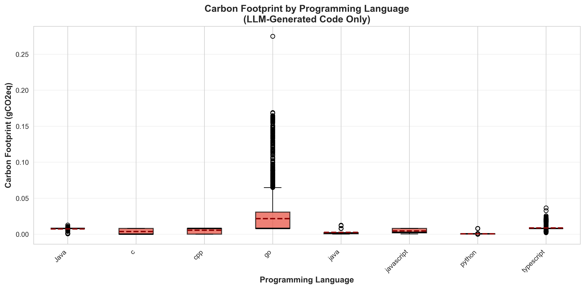

# Energy and Carbon Footprint Analysis Report
**Generated:** energy_improvements
---

## Global Statistics

### Base Code

| Metric | Mean | Median | Std | Min | Max | Count |
|--------|------|--------|-----|-----|-----|-------|
| Energy (J) | 189.67 | 12.57 | 289.22 | 0.03 | 1419.90 | 1607 |
| Carbon (gCO2eq) | 0.0211 | 0.0014 | 0.0321 | 0.0000 | 0.1578 | 1607 |

### LLM-Generated Code

| Metric | Mean | Median | Std | Min | Max | Count |
|--------|------|--------|-----|-----|-----|-------|
| Energy (J) | 105.25 | 71.29 | 163.88 | 0.02 | 2474.43 | 12785 |
| Carbon (gCO2eq) | 0.0117 | 0.0079 | 0.0182 | 0.0000 | 0.2749 | 12785 |

### Improvements (LLM vs Base)

| Metric | Mean | Median | Std | Min | Max |
|--------|------|--------|-----|-----|-----|
| Energy Improvement (%) | 4529.01 | -21.56 | 18559.34 | -99.87 | 185685.86 |
| Carbon Improvement (%) | 4529.01 | -21.56 | 18559.34 | -99.87 | 185685.86 |

**Note:** Negative improvement indicates reduction (better for sustainability).

## Results by LLM Model

| Model | Energy Mean (J) | Carbon Mean (gCO2eq) | Energy Impr (%) | Carbon Impr (%) |
|-------|-----------------|----------------------|-----------------|------------------|
| openAI | 102.33 | 0.0114 | 4596.02 | 4596.02 |
| claude | 103.74 | 0.0115 | 4473.36 | 4473.36 |
| gemini | 109.63 | 0.0122 | 4519.33 | 4519.33 |

## Results by Prompt Version

| Prompt | Energy Mean (J) | Carbon Mean (gCO2eq) | Energy Impr (%) | Carbon Impr (%) |
|--------|-----------------|----------------------|-----------------|------------------|
| v1 | 161.71 | 0.0180 | 2309.51 | 2309.51 |
| v2 | 86.08 | 0.0096 | 5281.43 | 5281.43 |
| v3 | 86.02 | 0.0096 | 5286.72 | 5286.72 |
| v4 | 84.54 | 0.0094 | 5342.21 | 5342.21 |

## Visualizations

### Energy and Carbon Distribution


### Analysis by Prompt Version


### Analysis by Model


### Analysis by Programming Language




---

## Methodology

### Energy Calculation Formula

```
1. exec_time_sec = exec_time_ms / 1000
2. cpu_power_watt = TDP_CPU * (CPU_usage% / 100)
3. ram_power_watt = (RAM_KB / 1048576) * POWER_PER_GB_RAM
4. total_power = (cpu_power + ram_power) * PUE_FACTOR
5. energy_joules = total_power * exec_time_sec
```

### Carbon Calculation Formula

```
1. energy_kwh = energy_joules / 3,600,000
2. carbon_gco2eq = energy_kwh * CARBON_INTENSITY
```

### Coefficients Used

- **TDP_CPU_WATT:** 95.0 W (typical desktop CPU)
- **POWER_PER_GB_RAM_WATT:** 0.375 W/GB (DDR4 average)
- **PUE_FACTOR:** 1.5 (data center efficiency)
- **CARBON_INTENSITY:** 400.0 gCO2eq/kWh (EU average)

**Note:** These values are configurable in `energy_config.json`.
